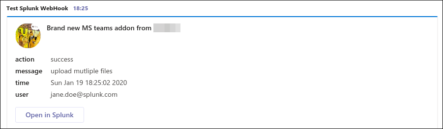
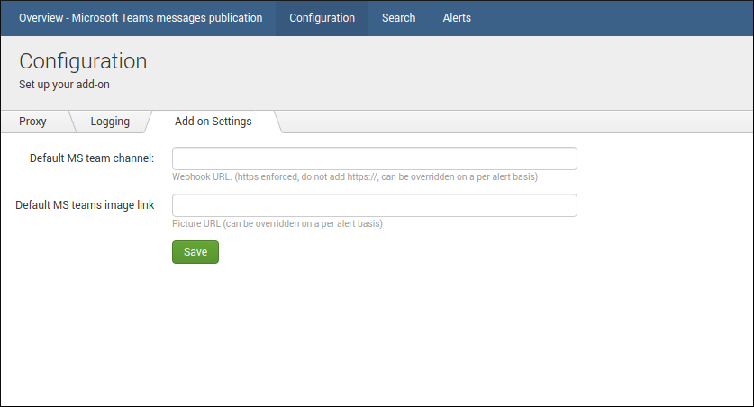
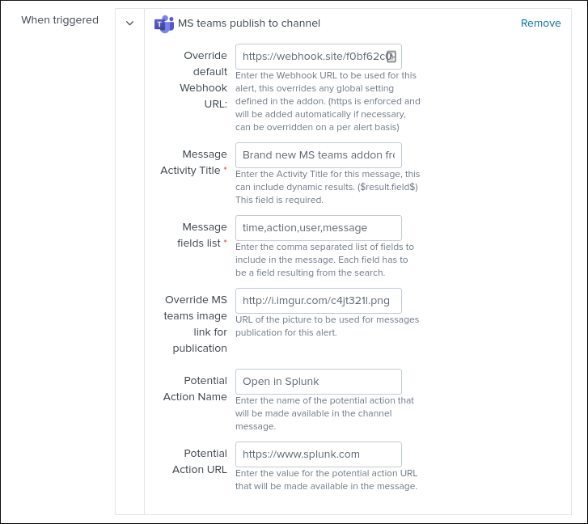

# Microsoft Teams alert action for Splunk

| branch | build status                                                                                                                                                                                 |
| ------ | -------------------------------------------------------------------------------------------------------------------------------------------------------------------------------------------- |
| master |  |

**This application provides alert actions for Microsoft Teams messages publication to allows advanced messages publication from Splunk, including:**

- Markdown support
- Defining options globally or on a per alert basis (per alert override)
- Defining comma separated list of fields which will be dynamically used to generated the markdown supported publication
- Choosing icon link for message publication
- Activating potential link action and defining its link

**Documentation is hosted online at:**

https://TA-ms-teams-alert-action.readthedocs.io

