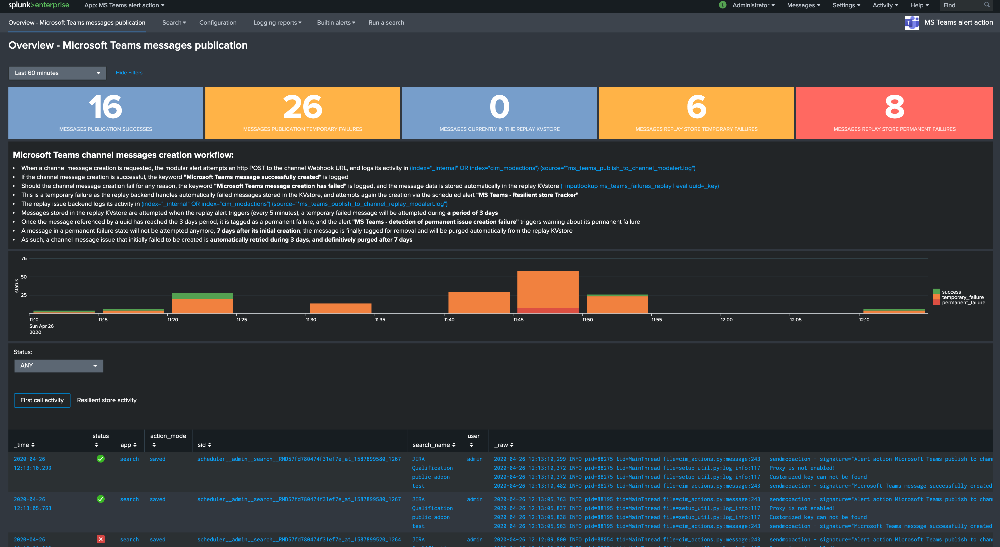

Configuration and usage
#######################

Global configuration
====================

**Once the application has been deployed, you can access to the main standard configuration and the app related items by opening the app and accessing to the configuration navigation bar menu:**

*Configuration home page:*

*Add-on settings:*

- **Default MS team channel:**

This defines a default Webhook URL to be used by default for the publication of messages.

The Webhook URL can be defined with or without https://, therefore https is enforced for certification compliance purposes and non SSL traffic is not allowed.

Finally, the default channel Webhook URL can be overridden on a per alert basis, this global configuration is only used if the per alert URL is not set.

This setting is optional and can be let unset in the global app configuration.

- **Default MS teams image link:**

In a similar fashion, this defines the icon link to be used by default when publishing to channels, this setting can be overridden on a per alert basis as well.

This setting is optional and  and can be let unset in the global app configuration.

- **URL regex compliancy checker:**

To avoid allowing the target URL to be set to a free value, and prevent data exflitration, you use this option to define a valid regular expression that will be applied automatically when the alert action triggers.

If the regular expression does not match the target URL, the alert action will be refused and the Python backend will not proceed to the Webhook call.

- **SSL certificate validation:**

If the option is checked, the Python backend will require the SSL certificate to be a valid certificate.

Per alert configuration
=======================

**When activating the Microsoft Teams channel publication alert action, different options are made available:**

- **Override default Webhook URL**

This defines the Webhook URL for the message publication, and will override any existing global configuration.

This item is optional only if the global equivalent has been set (obvious), similarly to global https is automatically enforced.

- **Message Activity Title**

This defines the main title of the message to be published, this setting is required.

- **Message fields list**

This defines a comma separated list of fields which result from the alert, these fields will be automatically extracted and formatted to be part of the published message.

This setting is required, and at least one field needs to be defined.

- **Override MS teams image link for publication**

This defines the icon link to be used for the message publication, and will override any global setting that has been set.

- **Theme color**

Specifies a custom brand color for the card in hexadecimal code format. (optional, defaults to 0076D7)

- **Potential Action Name** and **Potential Action URL**

These two items define the action link button and target that can automatically be added when the message is published in Microsoft Teams.

For this option to be activated, both of these items need to be configured, note that the URL can accept dynamic input fields resulting from the search.

**A second OopenURI action can be added in addition.**

**Message example:**

.. image:: img/message_example.png
   :alt: message_example.png
   :align: center
   :class: with-border

- **HttpPOST Action:**

You can add an HttpPOST action which users can use directly in Microsoft Teams, this is allows interacting with Splunk or an external system directly within the Teams interface.

*For more information, please consult the following documentation:*

https://docs.microsoft.com/en-us/outlook/actionable-messages/message-card-reference

Status dashboard
================

**An overview dashboard is available as the home page in the application to provide a minimal view over messages successfully published, and failures if any:**

Should there be any failures in publishing messages, the related information and logs are made available easily.

In addition, several reports and links provide quick access to the logs location.

Out the box alert for publishing failures detection
===================================================

**For a total operational safety, a builtin Splunk alert is provided which you can enable to get alerted if any messages failed to be published:**

Failures for publication can have different causes like network issues, typo or misconfiguration, as always the truth will be in the logs.

Using the alert action for non admin users
==========================================

**For non admin users to be able to use the alert action, the following role is provided out of the box:**

- msteams_alert_action

This role needs to be inherited for the users, or your users to be member of this role.

**The role provides:**

- capability ``list_storage_passwords``
- capability ``list_settings``
- write permission to the resilient KVstore ``kv_ms_teams_failures_replay``
